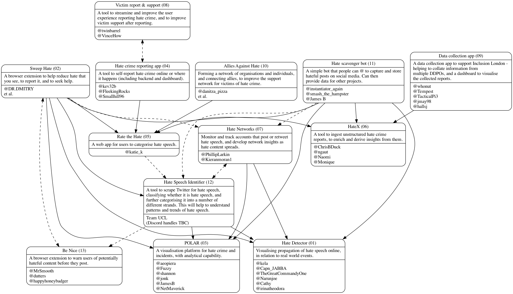

# Hack Hate 2020 projects

_Using graphviz/dot notation to represent Hack Hate 2020 projects, teams, and their interdependencies._

## Dependencies

* graphviz

## Editing

* Use `test.sh` to build and view (relies on `dot` and OS X command `open` to show `test.png`)
* Use `render.sh` to render a final cut into `hack-hate-2020-projects.png` (relies on `dot`)
